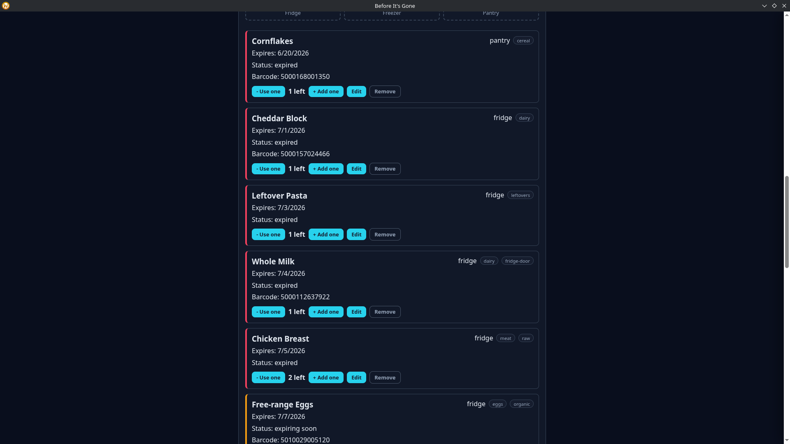
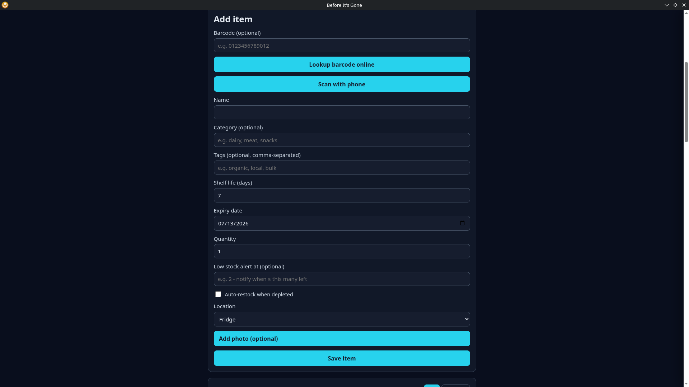
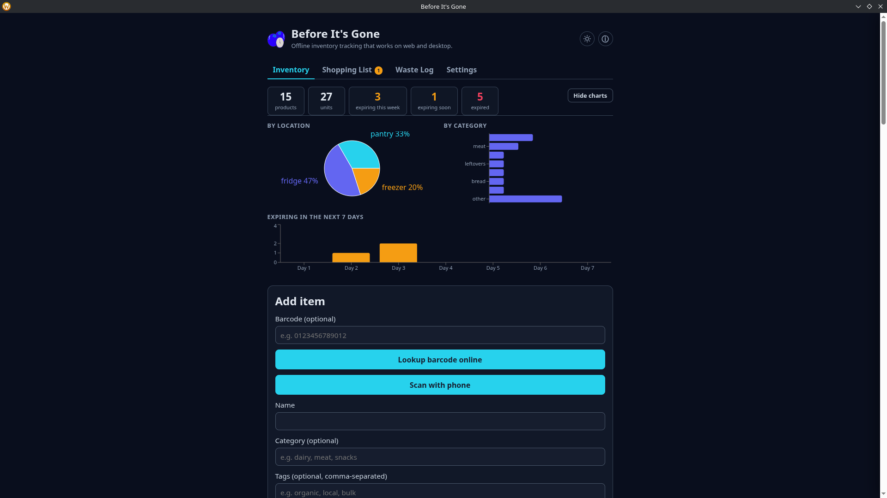
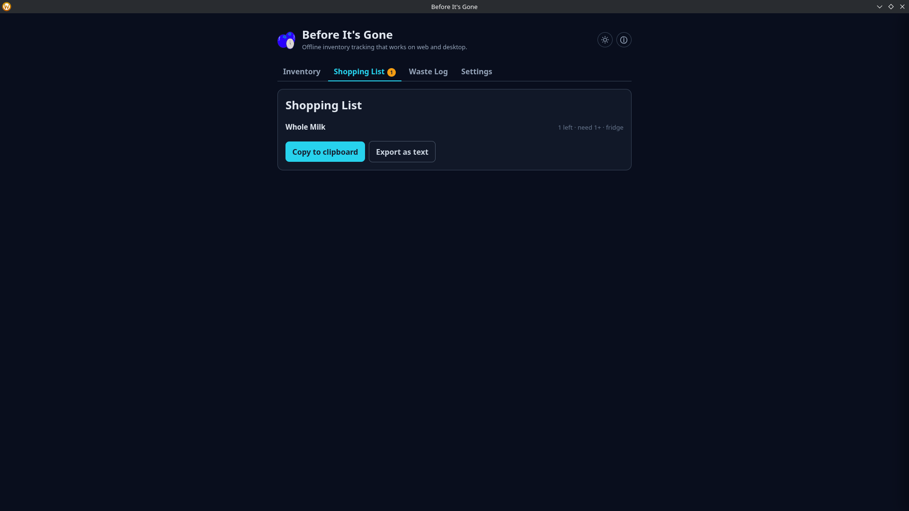
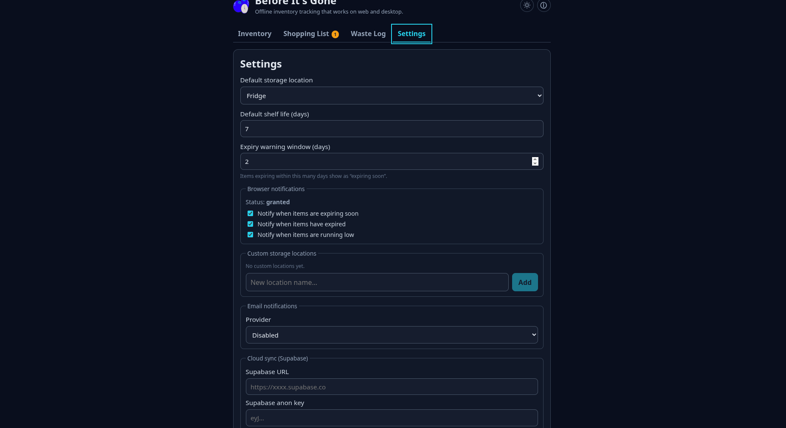

# Before It's Gone

> Track what's in your fridge, freezer, and pantry before it expires.

[](https://github.com/AetherAssembly/Before-Its-Gone/actions/workflows/ci.yml)
[](https://github.com/AetherAssembly/Before-Its-Gone/releases/latest)
[](https://github.com/AetherAssembly/Before-Its-Gone/releases)
[](LICENSE)
[](https://apt.aetherassembly.org)
[](https://apt.aetherassembly.org)

[](https://copr.fedorainfracloud.org/coprs/aster1630/before-its-gone-beta/package/before-its-gone-beta/)
[](https://build.opensuse.org/package/show/home:aster1630/before-its-gone-beta)
[](https://aetherassembly.org/wiki/before-its-gone)
[](https://gitlab.com/Aster1630/Before-Its-Gone)

Offline-first app — desktop (Electron) or self-hosted PWA. No account required; all data stays on your device.

---

## Features

Track expiry dates and get notified before things go off. Includes a shopping list, waste log, recipe suggestions, optional email digests, and opt-in Supabase cloud sync. Dark/light mode, drag-and-drop, and keyboard shortcuts. Barcode scanning works in both modes: in-browser camera on the PWA, phone-relay on the desktop.

Everything runs locally; the only outbound requests are Open Food Facts (barcode lookup), TheMealDB (recipe suggestions), and your own Supabase project if you enable sync.

---

## Screenshots

<details>
<summary>Inventory list</summary>



</details>

<details>
<summary>Add item</summary>



</details>

<details>
<summary>Charts</summary>



</details>

<details>
<summary>Shopping list</summary>



</details>

<details>
<summary>Settings</summary>



</details>

---

## Download

**Linux & macOS:**

```bash
curl -fsSL https://aetherassembly.org/install.sh | bash
```

**Windows** (PowerShell):

```powershell
irm https://aetherassembly.org/install.ps1 | iex
```

Auto-detects your distro, architecture, and package manager. Run the same command again to update.

Or grab a specific build from the [Releases](https://github.com/AetherAssembly/Before-Its-Gone/releases) page.

| Platform | Formats |
| --- | --- |
| Linux (x86_64) | AppImage · `.deb` · `.rpm` · `PKGBUILD` (Arch) |
| Linux (arm64) | AppImage · `.deb` (Raspberry Pi 4/5) |
| macOS | DMG |
| Windows | NSIS installer · Portable `.exe` |

**Fedora / RHEL / CentOS Stream / Rocky / Alma** ([COPR](https://copr.fedorainfracloud.org/coprs/aster1630/before-its-gone/)):

```bash
sudo dnf copr enable aster1630/before-its-gone
sudo dnf install before-its-gone
```

**openSUSE** ([OBS](https://build.opensuse.org/package/show/home:aster1630/before-its-gone)):

```bash
sudo zypper addrepo https://download.opensuse.org/repositories/home:aster1630/openSUSE_Tumbleweed/home:aster1630.repo
sudo zypper refresh && sudo zypper install before-its-gone
```

### Platform notes

**macOS:** the app is not notarized, so macOS may show a "damaged" warning. Run this after mounting the DMG:

```sh
xattr -d com.apple.quarantine "/Applications/Before Its Gone.app"
```

**Windows:** if SmartScreen warns on the installer, click **More info → Run anyway**. The app is not yet code-signed.

**Linux (Wayland/X11):** the app auto-detects your session. To override, set `BIG_LINUX_DISPLAY_BACKEND=wayland` or `=x11` before the binary/AppImage.

**Raspberry Pi:** Electron may log a SUID sandbox warning on first launch. The app still runs; see the [wiki](https://aetherassembly.org/wiki/before-its-gone/installation) to fix it permanently.

**Debian/Ubuntu/Raspberry Pi OS** — add the apt repo for automatic updates:

```bash
curl -fsSL https://apt.aetherassembly.org/beforeitsgone.gpg.pub | sudo gpg --dearmor -o /usr/share/keyrings/beforeitsgone.gpg
echo "deb [signed-by=/usr/share/keyrings/beforeitsgone.gpg] https://apt.aetherassembly.org stable main" | sudo tee /etc/apt/sources.list.d/beforeitsgone.list
sudo apt update && sudo apt install before-its-gone
```

See [docs/packaging/linux/debian](docs/packaging/linux/debian/README.md) for the key fingerprint to verify.

---

## Self-Hosted PWA

Run Before It's Gone as an installable Progressive Web App on any device on your LAN or Tailscale network — no Electron required.

**Barcode scanning:** when accessing from a phone or tablet, a **Scan barcode** button in the add-item form opens the device camera directly via `@zxing/browser`. No phone-relay server or QR code needed.

**Data:** all inventory data is stored in the browser's IndexedDB, per device. Optional Supabase sync works the same as in the desktop app if you want to share state across devices.

### Pre-built image (GHCR)

A Docker image is published to the GitHub Container Registry on every release. It exposes port 80 (HTTP) and is designed to run behind a reverse proxy (nginx, Caddy, Traefik) that handles TLS.

```bash
docker pull ghcr.io/aetherAssembly/before-its-gone:latest
docker run -d -p 8080:80 --name before-its-gone ghcr.io/aetherAssembly/before-its-gone:latest
```

Then open `http://localhost:8080` (or your server's IP). Pin a specific release with a version tag:

```bash
docker pull ghcr.io/aetherAssembly/before-its-gone:1.3.0
```

**With Caddy** (automatic HTTPS):

```json
before-its-gone.example.com {
    reverse_proxy localhost:8080
}
```

**With Tailscale + Caddy:** run `tailscale cert <hostname>` once and point Caddy at the provisioned cert; any device on your tailnet reaches it at `https://<hostname>` with a trusted cert.

### Building locally (self-signed HTTPS)

Clone the repo if you want to build the image yourself or use the self-signed cert setup for direct HTTPS without a reverse proxy.

**Prerequisites:** Docker and the repo cloned.

```bash
# Generate a self-signed certificate (run once)
mkdir -p docker/certs
openssl req -x509 -newkey rsa:4096 -keyout docker/certs/key.pem \
  -out docker/certs/cert.pem -days 3650 -nodes \
  -subj "/CN=before-its-gone-local"

# Build and start
npm run docker:pwa:up
```

Then open `https://<your-server-ip>` from any device on the same network. Accept the self-signed cert warning once per device. Use the browser's **Add to Home Screen** prompt to install it as an app.

| Script | What it does |
| --- | --- |
| `npm run docker:pwa:up` | Build image and start the container in the background |
| `npm run docker:pwa:down` | Stop and remove the container |
| `npm run docker:pwa:build` | Rebuild the image without starting |
| `npm run build:pwa` | Build the web bundle only (alias for `build:web`) |

---

## npm Packages

The core business logic and UI component are published to GitHub Packages and available for use in your own projects.

```bash
# configure your npm client to use the GitHub Packages registry for @aetherAssembly
echo "@aetherAssembly:registry=https://npm.pkg.github.com" >> .npmrc

npm install @aetherAssembly/core
npm install @aetherAssembly/ui
```

| Package | Description |
| --- | --- |
| [`@aetherAssembly/core`](https://github.com/AetherAssembly/Before-Its-Gone/pkgs/npm/core) | Inventory logic, IndexedDB storage, expiry calculations, import/export, email templates |
| [`@aetherAssembly/ui`](https://github.com/AetherAssembly/Before-Its-Gone/pkgs/npm/ui) | `InventoryCard` React component |

> **License notice:** both packages are published under [AGPL-3.0-only](LICENSE). If you use them in your own project, including as a network service, your project must also be released under AGPL-3.0 and its source made available to users. If that doesn't work for you, contact us at [support@aetherassembly.org](mailto:support@aetherassembly.org) to discuss a commercial licence.

---

## Development / Build From Source

### Prerequisites

- Node.js >= 22.12.0
- npm >= 10

### Setup

```bash
git clone https://github.com/AetherAssembly/Before-Its-Gone.git
cd Before-Its-Gone
npm install
```

### Commands

```bash
npm run dev              # Electron app with hot reload
npm run dev:web          # Web only (binds to LAN at 0.0.0.0:5173)
npm run build            # Full build
npm run test             # Unit tests (packages/core)
npm run test:coverage    # With branch coverage report (target: ≥ 80%)
npm run package:linux        # AppImage + .deb + .rpm (x86_64)
npm run package:linux:arm64  # AppImage + .deb + .rpm (arm64, cross-compiled)
npm run package:macos        # .dmg  (run on macOS)
npm run package:windows      # .exe  (run on Windows)
npm run docker:pwa:up    # Build and start the self-hosted PWA container
npm run docker:pwa:down  # Stop the container
```

---

## Docs

- [Architecture](docs/architecture.md): monorepo layout, storage map, IPC channels, build pipeline
- [Data Model](docs/data-model.md): `InventoryItem` field reference
- [Import & Export Format](docs/import-export-format.md): JSON, CSV, and barcode-list field reference
- [Email Notifications](docs/email-notifications.md): Resend and SMTP setup, digest scheduling, pause/snooze
- [Cloud Sync](docs/cloud-sync.md): Supabase project setup, SQL migration, and sync behaviour
- [API Setup](docs/api-setup.md): Open Food Facts and TheMealDB integration details
- [SMTP Config](docs/smtp-config.md): SMTP provider guide

---

## Privacy

All data is stored locally in IndexedDB by default. Optional features make outbound requests to Open Food Facts (barcode lookup), TheMealDB (recipe suggestions), your chosen email provider (digest emails), and your own Supabase project (cloud sync). See [PRIVACY_POLICY.md](PRIVACY_POLICY.md) for full details.

---

## License

[AGPL-3.0](LICENSE)
